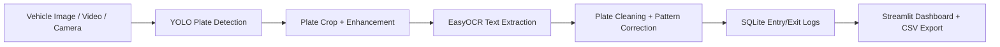

<p align="center">
  
</p>

<p align="center">
  
  
  
  
  
</p>

<p align="center">
  <b>AI-powered vehicle entry monitoring for images, videos, and live cameras.</b>
</p>

---

## System Snapshot



## What It Does

This project turns gate footage into a clean automated logging system:

- Detects vehicle number plates with a YOLO model.
- Extracts plate text with EasyOCR.
- Works with image upload, recorded video, and live camera input.
- Stores entry and exit records in SQLite.
- Prevents duplicate logs using a cooldown window.
- Exports logs and video reports as CSV.
- Supports custom YOLO weights through `models/best.pt` or sidebar upload.

## Core Modes

| Mode | What You Get |
|---|---|
| Image Detection | Original image, YOLO box, cropped plate, OCR debug crops, extracted number |
| Video Detection | Frame-by-frame detection, OCR table, sample frames, processed video preview |
| Live Camera Detection | Real-time feed, buffered sharp crop selection, entry/exit events |
| Logs | Search, status filter, SQLite records, CSV export |

## Tech Stack

| Layer | Tools |
|---|---|
| UI | Streamlit |
| Detection | Ultralytics YOLO |
| OCR | EasyOCR |
| Vision | OpenCV Headless |
| Data | SQLite, Pandas |
| Training | Ultralytics CLI + `train.py` |

## Project Structure

```text
entry-gate-automation/
  app.py
  train.py
  requirements.txt
  README.md
  models/
    best.pt
  src/
    detector.py
    ocr.py
    database.py
    video_processor.py
    camera.py
    utils.py
  data/
    uploads/
    outputs/
    logs.db
```

## Run Locally

```powershell
cd "D:\AIML Internship\entry-gate-automation"
python -m venv .venv
Set-ExecutionPolicy -Scope Process -ExecutionPolicy Bypass
.\.venv\Scripts\Activate.ps1
python -m pip install --upgrade pip
pip install -r requirements.txt
streamlit run app.py
```

Open:

```text
http://localhost:8501
```

## YOLO Model

The default model path is:

```text
models/best.pt
```

Use the included model for local testing, or replace it with your own trained number plate detector.

## Database

The app creates `data/logs.db` automatically.

```sql
CREATE TABLE vehicle_logs (
  id INTEGER PRIMARY KEY AUTOINCREMENT,
  vehicle_number TEXT NOT NULL,
  entry_time TEXT NOT NULL,
  exit_time TEXT,
  source_type TEXT NOT NULL,
  image_path TEXT,
  confidence_score REAL,
  status TEXT NOT NULL CHECK(status IN ('inside', 'exited'))
);
```

## Entry And Exit Logic

- First detection creates an `inside` entry.
- Re-detection after cooldown updates `exit_time` and marks the vehicle `exited`.
- Repeated detections inside the duplicate window are ignored.

## Train A Custom YOLO Plate Model

Dataset format:

```text
dataset/
  images/
    train/
    val/
  labels/
    train/
    val/
  data.yaml
```

Example `dataset/data.yaml`:

```yaml
path: dataset
train: images/train
val: images/val
names:
  0: number_plate
```

Train with Ultralytics:

```powershell
yolo detect train data=dataset/data.yaml model=yolov8n.pt epochs=50 imgsz=640
```

Or use the helper:

```powershell
python train.py --data dataset/data.yaml --model yolov8n.pt --epochs 50 --imgsz 640 --copy-best
```

Copy the trained weights to:

```text
models/best.pt
```

Then restart:

```powershell
streamlit run app.py
```

## Accuracy Tips

- Use clear, close plate images.
- Keep `Analyze every Nth frame` at `1` for video accuracy.
- Lower YOLO confidence if plates are missed.
- Raise OCR confidence to reduce weak OCR guesses.
- Train a custom YOLO model for your exact camera angle.

## Repository

```text
https://github.com/SrujanaPhadke/Entry-Gate-Automation-System.git
```
